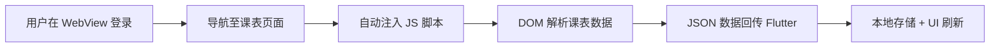

# 📚 吉林大学课程表 App (JLU Course App)

<div align="center">
  <p><strong>专为吉林大学学生打造的轻量级本地化课程表应用</strong></p>
  <p>
    
    
    
    
    
  </p>
</div>

基于 Flutter 开发的**免服务器**教务辅助应用。核心特性为**纯本地解析**：直接通过内置浏览器 (WebView) 登录吉林大学教务系统并提取数据，数据直接存储在本地，不经过任何第三方服务器，**最大化保障您的账号安全和隐私**。

---

## 🌟 核心特性

### 🔒 安全保障
- **纯本地无后端**：基于内置 WebView + JS 脚本提取数据，无第三方服务器中转
- **隐私优先**：所有数据直接存储在本地，告别密码泄露担忧
- **官方系统对接**：已适配吉林大学教务系统（`i.jlu.edu.cn`），同时支持 VPN 校外访问（`vpn.jlu.edu.cn`）

### 📅 功能特色
- **周视图 / 日视图**：清晰的课程表网格界面，支持按周次切换，左右滑动切换星期
- **多学期管理**：可保存多个学期课表，随时一键切换
- **课程编辑**：支持手动添加、修改、删除课程
- **桌面小组件**：直接在桌面查看今日课程及下一节课倒计时
- **暗黑模式**：自动跟随系统主题，护眼更舒适

### ⚡ 体验优化
- **自动周次计算**：设置开学日期后自动推算当前周次，无需手动调整
- **彩色课程标识**：每门课程自动分配固定颜色，一眼区分
- **高精度课程解析**：深度优化的 JS 提取逻辑，精准还原教室位置与上课时间
- **离线查看**：导入后支持完全离线访问课程表

---

## 🛠️ 技术架构

### 核心技术栈
- **框架**: Flutter 3.0+ (Dart 3.0+)
- **状态管理**: Provider
- **UI 设计**: Material Design 3

### 主要依赖
| 依赖包 | 版本 | 功能描述 |
|--------|------|----------|
| `webview_flutter` | ^4.7.0 | 内置安全浏览器环境 |
| `shared_preferences` | ^2.2.2 | 轻量级本地数据持久化 |
| `provider` | ^6.1.1 | 状态管理解决方案 |
| `home_widget` | ^0.6.0 | 桌面小组件支持 |

### 项目结构
```
lib/
├── main.dart                      # 应用入口
├── models/
│   └── course.dart                # 课程数据模型
├── screens/
│   ├── home_screen.dart           # 主页（底部导航）
│   ├── course_table_screen.dart   # 课表展示页面
│   ├── course_edit_screen.dart    # 课程编辑页面
│   ├── login_screen.dart          # 登录入口页面
│   └── settings_screen.dart       # 设置页面
├── widgets/
│   ├── course_card.dart           # 课程卡片组件
│   ├── semester_switch_dialog.dart # 学期切换弹窗
│   └── simple_webview_login.dart  # WebView 登录组件
└── services/
    ├── course_service.dart        # 课程数据管理
    └── widget_service.dart        # 桌面小组件服务
```

---

## 📦 安装与使用

### 💾 下载应用
前往 [Releases](https://github.com/ZincGluxx/JLU_COURSE_APP/releases) 页面下载最新版本：
- 📱 **Android APK**: 提供 `arm64-v8a` 和 `armeabi-v7a` 双架构版本

### 🚀 快速开始

1. 下载并安装 APK 文件
2. 打开应用，进入**设置**页面，点击**导入课表**
3. 选择登录方式：
   - **普通登录**：适用于校内网络，访问 `i.jlu.edu.cn`
   - **VPN 登录**：适用于校外网络，访问 `vpn.jlu.edu.cn`
4. 在内置浏览器中完成登录，导航至"我的课表"页面
5. 点击右上角**下载按钮**提取并保存课程数据
6. 在设置中设置**开学日期**，应用将自动计算当前周次

> 详细说明请参见 [QUICK_START.md](QUICK_START.md)

### 🔧 从源码编译

#### 环境要求
- Flutter 3.0+
- Android SDK (API 21+)
- Dart 3.0+

#### Windows 编译（推荐配置国内镜像）
```powershell
# 配置国内镜像
$env:PUB_HOSTED_URL="https://pub.flutter-io.cn"
$env:FLUTTER_STORAGE_BASE_URL="https://storage.flutter-io.cn"

# 获取依赖并构建
flutter pub get
flutter build apk --split-per-abi --release
```

#### Linux/macOS 编译
```bash
flutter pub get
flutter build apk --split-per-abi --release
```

**构建产物位置**: `build/app/outputs/flutter-apk/`

---

## 🚀 工作原理

### 免服务器数据获取方案



### 实现步骤

1. **🌐 WebView 登录**
   - 利用 `webview_flutter` 插件打开教务系统登录页
   - 支持校内直连（`i.jlu.edu.cn`）和 VPN 校外访问（`vpn.jlu.edu.cn`）两种方式

2. **💉 JavaScript 数据提取**
   - 用户在课表页面点击下载按钮后，执行预编写的 JS 脚本
   - JS 脚本解析页面 DOM，提取课程名称、教师、地点、时间、周次等信息

3. **🔍 数据解析与存储**
   - 提取的数据以 JSON 格式回传至 Flutter 层
   - 用户确认学期标识后，通过 SharedPreferences 本地持久化

4. **📱 界面展示**
   - 自动计算当前周次（依据开学日期）
   - 刷新课表视图，支持周视图与日视图切换

### 🛡️ 安全说明
- ✅ 数据不经过任何第三方服务器
- ✅ 登录凭据仅在本地 WebView 中使用
- ✅ 支持清除所有本地数据
- ✅ 开源透明，代码可审计

---

## 📖 开发者文档

如果您想进一步了解教务接口或贡献代码，项目内附带了相关研究文档和辅助脚本：

- **WebView 登录详解**: [WEBVIEW_LOGIN_GUIDE.md](WEBVIEW_LOGIN_GUIDE.md)
- **教务 API 研究**: [JLU_API_GUIDE.md](JLU_API_GUIDE.md)、[CRAWLER_USAGE.md](CRAWLER_USAGE.md)
- **Python 辅助脚本**: [tools/README.md](tools/README.md)（存放于 `tools/` 目录，用于 PC 端调试教务接口）

---

## 🤝 贡献指南

1. Fork 本仓库
2. 创建特性分支 (`git checkout -b feature/AmazingFeature`)
3. 提交修改 (`git commit -m 'Add some AmazingFeature'`)
4. 推送分支 (`git push origin feature/AmazingFeature`)
5. 开启 Pull Request

---

## 📄 License

该项目基于 **GPL v3** 开源，详见 [GNU General Public License v3.0](https://www.gnu.org/licenses/gpl-3.0.html)。
